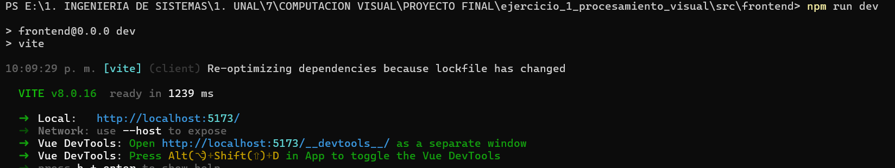
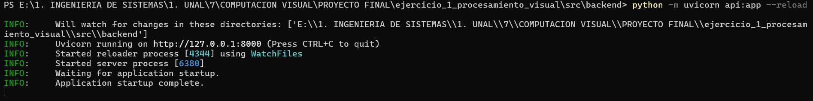
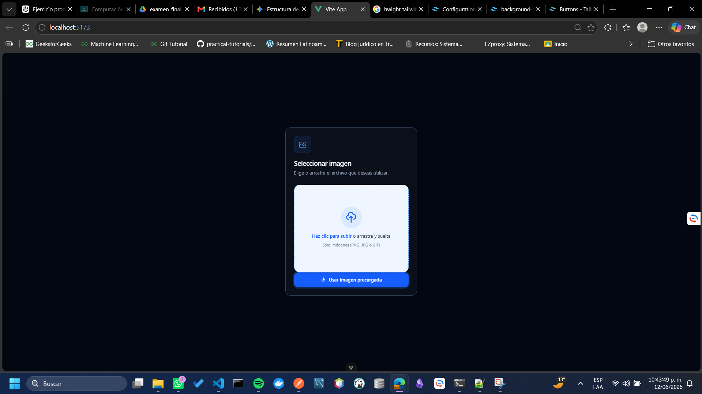

# Primer ejercicio - parcial final - computación visual 👀 
## Datos del estudiante 🧑‍🎓
- Camilo Andrés Medina Sánchez
- Universidad Nacional de Colombia
- Facultad de ingeniería 
- Departamento de sistemas e industrial
- 2026 - 1S

## Enunciado 📜

Desarrollar una aplicación en python que procese una imagen o un video corto y genere resultados visuales compatibles.
Este ejercicio debe quedar definido como una **secuencia clara de operaciones**.

## Descripción de la solución 💫

El enunciado del ejercicio indica que se debe generar una solución sencilla que permita mostrar ciertos procesos sobre una imagen, con el fin de generar una implementación más completa, se desarrolla la creación de un servicio sencillo de API Rest, el cual permita el cargado de una imagen seleccionada por el usuario y la visualización de los resultados de la imagen luego de las transformaciones correspondientes. De esta manera, el proceso será más interactivo y entendible para el usuario.

### Estructura de archivos 📁
A continuación, se muestra el árbol de archivos de manera resumida, de manera que solo se incluyan los archivos más importantes.
```
PROYECTO FINAL/
└── ejercicio_1_procesamiento_visual/
    ├── media/
    ├── resultados/
    └── src/
        ├── README.md
        ├── backend/
        │   ├── services/
        │   │   └── image_processor.py
        │   └── api.py
        └── frontend/
            ├── public/
            │   ├── examples/
            │   │   ├── penia.png
            │   │   └── munera.png
            ├── src/
            │   ├── assets/
            │   ├── components/
            │   ├── router/
            │   ├── services/
            │   ├── views/
            │   ├── App.vue
            │   └── main.js
```

### Tecnologías utilizadas

#### Frontend

Para el desarrollo del front end se hizo uso del framework vue, para los llamados a la API se hace uso de Axios. Además, para tener estilos más avanzados y profesionales, mientras se reduce la cantidad de código escrito, se incluyó tailwind para la gestión del css.

#### Backend

Para el desarrollo del backend, se hace uso de fastapi, un framework de python muy sencillo que permite la creación de servidores web con arquitectura de api rest, las librerias que fueron usadas para la gestión, procesamiento y manejo de las imagenes fueron cv2.

## Ejecución 

### Frontend

Para la ejecución del frontend se debe hacer uso de los siguientes comandos, teniendo en cuenta antes que se debe tener npm instalado. 

1. Dirigirse al directorio `BASE_DIR/ejercicio_1_procesamiento_visual/frontend/`
2. Ejecutar `npm install`
3. Ejecutar `npm run dev`

```powershell
> cd "BASE_DIR/ejercicio_1_procesamiento_visual/frontend/"
> npm install
> npm run dev
```


### Backend

Para la ejecución del backend se debe hacer uso de los siguientes comandos, teniendo en cuenta antes que se debe tener python instalado y uvicorn. 
En caso de que uvicorn no esté, se puede instalar mediante el comando

```powershell
pip install uvicorn
```

1. Dirigirse al directorio `BASE_DIR/ejercicio_1_procesamiento_visual/backend/`
2. Ejecutar `python -m uvicorn api:app --host 0.0.0.0 --port 8000 --reload`

```powershell
> pip install uvicorn
> cd "BASE_DIR/ejercicio_1_procesamiento_visual/backend/"
> python -m uvicorn api:app --host 0.0.0.0 --port 8000 --reload
```


## Manual de usuario

Cuando ya está en ejecución tanto el backend como el frontend, es posible comenzar a interactuar con el proyecto creado. Como primera medida, al entrar al endpoint del front end (Por lo general será `http://localhost:5173/`). Desde el, la primer interfaz que se verá, solicitará el cargado de una imagen o el uso de imagenes precargadas.

Como se logra ver en la imagen anterior, se le solicita al usuario subir una imagen personalizada o también se le permite seleccionar una imagen ya existente de forma aleatoria.

**ADVERTENCIA IMPORTANTE: La imagen seleccionada y la ruta en la que se encuentra no puede tener caracteres especiales en su nombre, esto genera una falla en el proyecto.**


## Conceptos técnicos

## Resultados y explicaciones

## Documentación técnica

### Backend

La implementación del backend solo tiene dos archivos bastante sencillos. Uno para el controlador y otro para la ejecución de los servicios

#### Controlador

El archivo del controlador [llamado api.py](./src/backend/api.py) es el que define: 
- Endpoints disponibles.
- Configuraciones de seguridad.

##### Configuraciones de seguridad

Las configuraciones más importantes, son las de CORS, si estas no se tienen en cuenta, va a ser imposible el llamado de front a back por medio de axios, pues el backend no va a permitir el ingreso de la solicitud. 

```python
app.add_middleware(
    CORSMiddleware,
    allow_origins=["*"],
    allow_credentials=True,
    allow_methods=["*"],
    allow_headers=["*"]
)
```
Por facilidad, se permiten solicitudes de cualquier origen, con cualquier método (A pesar de que solo existe un endpoint que solo permite el método post), con cualquier contenido en el encabezado. Esta decisión se tomo al ser un proyecto meramente demostrativo. 

##### Configuraciones de directorios

Ahora bien, uno de los principales requisitos fue el guardado de las imagenes en el directorio `resultados`. Aún teniendo en cuenta que los resultados se muestran en la interfaz de frontend, con el fin de cumplir con el requisito se desarolla el guardado en la carpeta mencionada. 
No obstante, es necesario el desarrollo de ciertas configuraciones para que este proceso de guardao se puyeda desarollar de manera exitosa. 

```python
BASE_DIR = Path(__file__).resolve().parents[2]

RESULT_DIR = BASE_DIR / "resultados"

RESULT_DIR.mkdir(exist_ok=True)

app.mount("/resultados", StaticFiles(directory=str(RESULT_DIR)), name="resultados")
```

Como primera medida se obtiene la raiz del proyecto, teniendo en cuenta que este se está ejecutando desde api.py y se devuelve en dos directorios con el fin de poder acceder al directorio de resultados. Notese, que si este no existe, es creado.

##### Configuración del endpoint

El único endpoint disponible será aquel que permita procesar las imagenes y guardarlas en el directorio establecido. 
La implementación de este es muy sencilla

```python
@app.post("/process")
async def process(file: UploadFile = File(...)):

    image_path = RESULT_DIR / file.filename

    with open(image_path, "wb") as buffer:
        shutil.copyfileobj(file.file, buffer)

    print("Guardando archivo en:", image_path)

    print("Existe:", Path(image_path).exists())
    image_processor.process_image(str(image_path))

    return {
        "original": "http://localhost:8000/resultados/original.png",
        "grises": "http://localhost:8000/resultados/grises.png",
        "hsv": "http://localhost:8000/resultados/hsv_o_lab.png",
        "suavizado": "http://localhost:8000/resultados/suavizado.png",
        "bordes": "http://localhost:8000/resultados/bordes.png",
        "segmentacion": "http://localhost:8000/resultados/deteccion_o_segmentacion.png"
    }
```

Notese que la tarea que se desarrola es: 
1. Guardado de la imagen original en la carpeta de resultados
2. Impresión por consola del proceso de guardado y verificación de existencia 
3. Llamado del servicio de transformado de imagenes
4. Retorno de las rutas en las cuales quedaron las imagenes con transformaciones

#### Servicio

Por medio de esta subsección se pretende explicar de forma estructurada y técnica el funcionamiento del servicio de procesamiento de imagenes.

### Frontend

## Referencias 

- https://v3.tailwindcss.com/docs/configuration