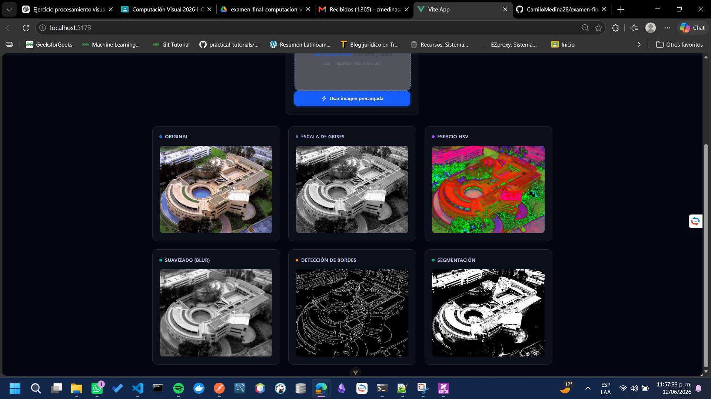
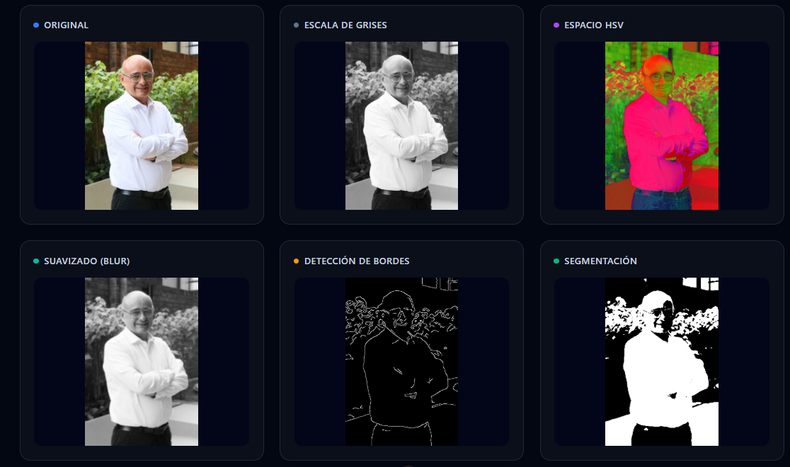
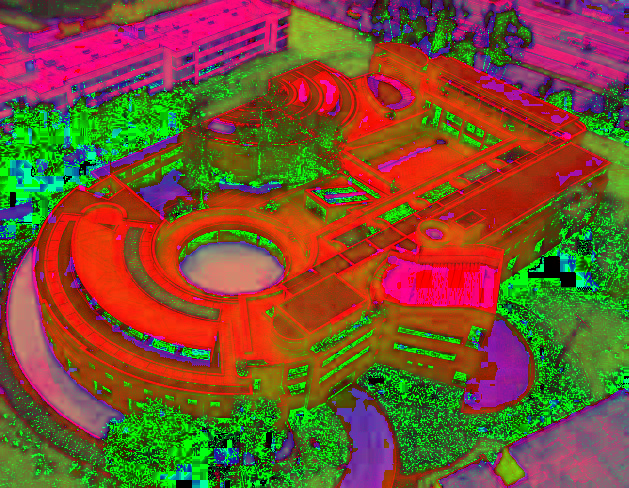

# Primer ejercicio - parcial final - computación visual 👀 
## Datos del estudiante 🧑‍🎓
- Camilo Andrés Medina Sánchez
- Universidad Nacional de Colombia
- Facultad de ingeniería 
- Departamento de sistemas e industrial
- 2026 - 1S

## Enunciado 📜

Desarrollar una aplicación en python que procese una imagen o un video corto y genere resultados visuales compatibles.
Este ejercicio debe quedar definido como una **secuencia clara de operaciones**.

## Descripción de la solución 💫

El enunciado del ejercicio indica que se debe generar una solución sencilla que permita mostrar ciertos procesos sobre una imagen, con el fin de generar una implementación más completa, se desarrolla la creación de un servicio sencillo de API Rest, el cual permita el cargado de una imagen seleccionada por el usuario y la visualización de los resultados de la imagen luego de las transformaciones correspondientes. De esta manera, el proceso será más interactivo y entendible para el usuario.

### Estructura de archivos 📁
A continuación, se muestra el árbol de archivos de manera resumida, de manera que solo se incluyan los archivos más importantes.
```
PROYECTO FINAL/
└── ejercicio_1_procesamiento_visual/
    ├── media/
    ├── resultados/
    └── src/
        ├── README.md
        ├── backend/
        │   ├── services/
        │   │   └── image_processor.py
        │   └── api.py
        └── frontend/
            ├── public/
            │   ├── examples/
            │   │   ├── penia.png
            │   │   └── munera.png
            ├── src/
            │   ├── assets/
            │   ├── components/
            │   ├── router/
            │   ├── services/
            │   ├── views/
            │   ├── App.vue
            │   └── main.js
```

### Tecnologías utilizadas

#### Frontend

Para el desarrollo del front end se hizo uso del framework vue, para los llamados a la API se hace uso de Axios. Además, para tener estilos más avanzados y profesionales, mientras se reduce la cantidad de código escrito, se incluyó tailwind para la gestión del css.

#### Backend

Para el desarrollo del backend, se hace uso de fastapi, un framework de python muy sencillo que permite la creación de servidores web con arquitectura de api rest, las librerias que fueron usadas para la gestión, procesamiento y manejo de las imagenes fueron cv2.

## Ejecución 

### Frontend

Para la ejecución del frontend se debe hacer uso de los siguientes comandos, teniendo en cuenta antes que se debe tener npm instalado. 

1. Dirigirse al directorio `BASE_DIR/ejercicio_1_procesamiento_visual/frontend/`
2. Ejecutar `npm install`
3. Ejecutar `npm run dev`

```powershell
> cd "BASE_DIR/ejercicio_1_procesamiento_visual/frontend/"
> npm install
> npm run dev
```


### Backend

Para la ejecución del backend se debe hacer uso de los siguientes comandos, teniendo en cuenta antes que se debe tener python instalado y uvicorn. 
En caso de que uvicorn no esté, se puede instalar mediante el comando

```powershell
pip install uvicorn
```

1. Dirigirse al directorio `BASE_DIR/ejercicio_1_procesamiento_visual/backend/`
2. Ejecutar `python -m uvicorn api:app --host 0.0.0.0 --port 8000 --reload`

```powershell
> pip install uvicorn
> cd "BASE_DIR/ejercicio_1_procesamiento_visual/backend/"
> python -m uvicorn api:app --host 0.0.0.0 --port 8000 --reload
```


## Manual de usuario

Cuando ya está en ejecución tanto el backend como el frontend, es posible comenzar a interactuar con el proyecto creado. Como primera medida, al entrar al endpoint del front end (Por lo general será `http://localhost:5173/`). Desde el, la primer interfaz que se verá, solicitará el cargado de una imagen o el uso de imagenes precargadas.

Como se logra ver en la imagen anterior, se le solicita al usuario subir una imagen personalizada o también se le permite seleccionar una imagen ya existente de forma aleatoria.

**ADVERTENCIA IMPORTANTE: La imagen seleccionada y la ruta en la que se encuentra no puede tener caracteres especiales en su nombre, esto genera una falla en el proyecto.**

Luego de seleccionar la imagen aleatoria, se manera breve aparece un cargando animado y cuando se recibe respuesta de backend, que suele ser muy rapido, se puede ver la siguiente interfaz. 




Como se logra ver en las imagenes previas, se desarrolló una interfaz de usuario muy sencilla de utilizar con el fin de poder ver de forma gráfica los resultados obtenidos.

## Conceptos técnicos

El procesado de imagenes es crucial en la computación visual, por definición, es necesario el descubrimiento de técnicas que permitan a los computadores ese manejo. 
Se debe partir del principio de que computacionalmente una imagen es representada por un objeto matemático denominado tensor, un tensor puede ser asociado a una matriz con tres dimensiones, siendo estas RGB. 
Como se puede inferir, tener tres canales es computacionalmente complejo en términos de procesamiento, es por ello que se procede a hablar del primer filtro aplicado. 

### Conversión a blanco y negro - escala de grises

El procesado de conversión de RGB a blanco y negro permite la simplificación de la representación matemática de una imagen, al pasar a un solo canal I que representa el brillo.

Tengase en cuenta que al pasar de una imagen de color a una en blanco y negro las estructuras persisten. Es decir, un carro a color no deja de ser un carro si está en escala de grises, es por ellos que es de mucha ayuda al momento de procesar las imagenes.

El proceso de conversión de una imagen a color a blanco y negro se desarrolla por medio de una combinación lineal, siendo esta: 
`𝑌 = 0.299 𝑅 + 0.587 𝐺 + 0.114 𝐵 `

### Cambio a espacio de color HSV

Según las fuentes consultadas HSV tiene como objetivo la representación de imagenes de manera similar a como los seres humanos las vemos. Es evidente que el resultado obtenido puede llegar a ser controversial.

- Hue - H: Tono
- Saturation - S: Saturación 
- Value - V: Valor o brillo

Estas representaciones son bastante utiles en robótica y en el procesaimento de imagenes pues permiten la detección de objetos basados en sus tonalidades. 

### Gaussian blur

El suavizado gaussiano es una técnica utilizada para reducir el ruido y las pequeñas variaciones de intensidad presentes en una imagen. Su funcionamiento se basa en una distribución gaussiana que asigna mayor peso a los pixeles cercanos al pixel central y menor a los más alejados.

$$G(x,y) = \frac{1}{2\pi\sigma^2}e^{ -\frac{x^2+y^2}{2\sigma^2} }$$

Donde σ controla el nivel de dispersión del suavizado. Valores mayores de σ generan un desenfoque más pronunciado.

Este tipo de filtro es ampliamente utilizado en visión por computador, procesamiento de imágenes médicas, sistemas de navegación autónoma y aplicaciones de inteligencia artificial, ya que mejora la calidad de la información visual antes de aplicar etapas más complejas de análisis. En el contexto de este proyecto, el suavizado gaussiano permitió obtener una imagen más estable y adecuada para la posterior detección de bordes mediante el algoritmo Canny.

Permitamonos comparar las imagenes en escala de grises y luego del suavizado 
| Grises | Suavizado |
|--------|-----------|
|||

Como se puede ver hay algunas diferencias entre cada una de las imagenes, los bordes son un poco más borrosos pero definido, hay menos ruido pues los detalles irrelevantes desaparecen y las texturas se ven más suaves.

### Canny

La detección de bordes, de manera obvia, permite la definción de limites, contornos y fronteras entre diferentes objetos presentes en una imagen.
Para este proyecto se hace uso del algoritmo canny edge detection con el fin de identificar una imagen cuyos bordes han sido procesados.

Un borde aparece cuando se encuentra un cambio brusco entre los pixeles alrededor, vease con la siguiente matriz de ejemplo.

50  52  49  51 48
50  53  50  49  51
48  50  52  200 205
49  51  198 210 220

Vemos que se tienen valores cercanos a los 50, pero en la esquina inferior derecha hay valores que tienden a los 200.
Notese que antes de ejecutar un algoritmo de detección de bordes, se necesita pasar por un filtro gaussiano, como se explicó anteriormente, este permite reducir el ruido y la información irrelevante en una imagen.

### Segmentación

La segmentación es un proceso muy sencillo, en este caso se desarrolla sobre la imagen que está en blanco y negro. 
El valor umbral elegido fue el 127. Cualquier valor por debajo de ese umbral se convierte en cero. Por otro lado, cualquier valor superior se convierte a 255. De esta forma se puede diferenciar entre fondo y objeto.
Por supuesto, para tener un mejor proceso de segmentación se debe convertir a escala de grises y pasar por un filtrado gaussiano. Por las razones que ya se han expuesto con anterioridad. 

## Resultados y explicaciones

|         Imagen original         |            Bordes            |           deteccion/segmentacion           |
|---------------------------------|------------------------------|--------------------------------------------|
|| ||

|            Grises           |               HSV/lab             |              Suavizado            |
|-----------------------------|-----------------------------------|-----------------------------------|
||  ||


## Documentación técnica

### Backend

La implementación del backend solo tiene dos archivos bastante sencillos. Uno para el controlador y otro para la ejecución de los servicios

#### Controlador

El archivo del controlador [llamado api.py](./src/backend/api.py) es el que define: 
- Endpoints disponibles.
- Configuraciones de seguridad.

##### Configuraciones de seguridad

Las configuraciones más importantes, son las de CORS, si estas no se tienen en cuenta, va a ser imposible el llamado de front a back por medio de axios, pues el backend no va a permitir el ingreso de la solicitud. 

```python
app.add_middleware(
    CORSMiddleware,
    allow_origins=["*"],
    allow_credentials=True,
    allow_methods=["*"],
    allow_headers=["*"]
)
```
Por facilidad, se permiten solicitudes de cualquier origen, con cualquier método (A pesar de que solo existe un endpoint que solo permite el método post), con cualquier contenido en el encabezado. Esta decisión se tomo al ser un proyecto meramente demostrativo. 

##### Configuraciones de directorios

Ahora bien, uno de los principales requisitos fue el guardado de las imagenes en el directorio `resultados`. Aún teniendo en cuenta que los resultados se muestran en la interfaz de frontend, con el fin de cumplir con el requisito se desarolla el guardado en la carpeta mencionada. 
No obstante, es necesario el desarrollo de ciertas configuraciones para que este proceso de guardao se puyeda desarollar de manera exitosa. 

```python
BASE_DIR = Path(__file__).resolve().parents[2]

RESULT_DIR = BASE_DIR / "resultados"

RESULT_DIR.mkdir(exist_ok=True)

app.mount("/resultados", StaticFiles(directory=str(RESULT_DIR)), name="resultados")
```

Como primera medida se obtiene la raiz del proyecto, teniendo en cuenta que este se está ejecutando desde api.py y se devuelve en dos directorios con el fin de poder acceder al directorio de resultados. Notese, que si este no existe, es creado.

##### Configuración del endpoint

El único endpoint disponible será aquel que permita procesar las imagenes y guardarlas en el directorio establecido. 
La implementación de este es muy sencilla

```python
@app.post("/process")
async def process(file: UploadFile = File(...)):

    image_path = RESULT_DIR / file.filename

    with open(image_path, "wb") as buffer:
        shutil.copyfileobj(file.file, buffer)

    print("Guardando archivo en:", image_path)

    print("Existe:", Path(image_path).exists())
    image_processor.process_image(str(image_path))

    return {
        "original": "http://localhost:8000/resultados/original.png",
        "grises": "http://localhost:8000/resultados/grises.png",
        "hsv": "http://localhost:8000/resultados/hsv_o_lab.png",
        "suavizado": "http://localhost:8000/resultados/suavizado.png",
        "bordes": "http://localhost:8000/resultados/bordes.png",
        "segmentacion": "http://localhost:8000/resultados/deteccion_o_segmentacion.png"
    }
```

Notese que la tarea que se desarrola es: 
1. Guardado de la imagen original en la carpeta de resultados
2. Impresión por consola del proceso de guardado y verificación de existencia 
3. Llamado del servicio de transformado de imagenes
4. Retorno de las rutas en las cuales quedaron las imagenes con transformaciones

#### Servicio

Por medio de esta subsección se pretende explicar de forma estructurada y técnica el funcionamiento del servicio de procesamiento de imagenes.

En la sección del servicio también es importante el profceso de manejo de las rutas de archivos, puesto que los resultados serán guardados en la carpeta ya mencionada. 

##### Conversión a escala de grises
A continuación, se muestra el proceso que se desarrolla desde la libreria cv2 con el fin de convertir la imagen de color a escala de grises
```python
gray = cv2.cvtColor(image, cv2.COLOR_BGR2GRAY)
gray_path = RESULT_DIR / "grises.png"
cv2.imwrite(str(gray_path), gray)
```
Como se puede identificar en el bloque anterior el proceso es bastante automático, en los siguientes bloques también se podrá identificar esta simplicidad en las mascaras aplicadas a las imagenes.

##### Conversión a HSV
```python
hsv = cv2.cvtColor(image, cv2.COLOR_BGR2HSV)
hsv_path = RESULT_DIR / "hsv_o_lab.png"
cv2.imwrite(str(hsv_path), hsv)
```

##### Filtro gaussiano
```python
blur = cv2.GaussianBlur(
    gray,
    (5, 5),
    0
)
blur_path = RESULT_DIR / "suavizado.png"
cv2.imwrite(str(blur_path), blur)
```
Los argumentos pasados a esta función son:
1. Imagen en escala de grises
2. Tamaño del kernel o máscara de convolución
3. sigmaX: Calculo automático de la desviación estandar $\sigma$.

##### Edges

```python
edges = cv2.Canny(
    blur,
    100,
    200
)
edges_path = RESULT_DIR / "bordes.png"
cv2.imwrite(str(edges_path), edges)
```
Los argumentos pasados a esta función son:
1. Imagen luego de aplicar el filtro gaussiano
2. Valor minimo para que el cambio de intensidad sea un borde
3. Los gradientes mayores a este valor se consideran bordes fuertes.

##### Segmentación 
```python
_, segmentation = cv2.threshold(
        gray,
        127,
        255,
        cv2.THRESH_BINARY
    )
```
Los valores que toma la segmentación fueron mencionados más atras en este documento. 
Menos de 127 se transforma a un cero y superior a estos a 255.

### Frontend

#### Configuración de la API por medio de Axios

El proceso de configuración de Axios es bastante sencillo, busca indicar la URL a la cual se deben desarrollar las solicitudes. 
```javascript
import axios from "axios";

export default axios.create({
    baseURL: "http://localhost:8000"
});
```
En el caso anterior, se logra identificar que el backend estará expuesto en el puerto 8000 y que todas las solicitudes deberán ser echas allí.

#### Creación de componentes

Se generaron tres componentes básicos para ser inyectados en una vista en general, estos son:
- imageComparison: Este componente busca comparar las seis imagenes en una sola interfaz se manera que el usuario pueda ver su imagen original luego de pasar por las convoluciones ya mencionadas.
- loading: Es un pequeño asset que muestra una animación de cargado mientras el servidor da una respuesta.
- uploadcard: Es la interfaz que permite la selección de un archivo de imagen por parte del usuario con el fin de ver la convolución aplicada.

#### Script de proceso de solicitudes

```javascript
import { ref } from "vue";

import UploadCard from "../components/uploadCard.vue";
import ImageComparison from "../components/imageComparison.vue";
import LoadingSpinner from "../components/loading.vue";

import api from "../services/api";

const loading = ref(false);
const results = ref(null);

const imagenes_ejemplo = ["penia.png", "munera.png", "salmona.png", "potter.png"];

const processImage = async (file) => {
  loading.value = true;
  try {
    const formData = new FormData();
    formData.append(
      "file",
      file
    );
    const response = await api.post(
      "/process",
      formData,
      {
        headers: {
          "Content-Type": "multipart/form-data"
        }
      }
    );
    results.value = response.data;
  } catch (error) {
    console.error(error);
  } finally {
    loading.value = false;
  }
};

const useRandomImage = async () => {
  loading.value = true;

  try{
    const randomIndex = Math.floor(Math.random() * imagenes_ejemplo.length);
    const imagen = imagenes_ejemplo[randomIndex];
    const imageUrl = `/examples/${imagen}`;

    const response = await fetch(imageUrl);

    console.log(response.status);
    console.log(response.headers.get("content-type"));

    if (!response.ok) throw new Error("No se pudo cargar la imagen precargada");
    const blob = await response.blob();
    console.log(blob.size);
    console.log(blob.type);
    const file = new File([blob], imagen, { type: blob.type });
    await processImage(file);
  }catch(error){
    console.error(error);
    loading.value = false;
  }
};
```

El script anterior es el que permite el manejo de las solicitudes al backend. 

En la primera sección se incluyen las rutas de los componentes que se deben inyectar en la visualización principal.
A su vez, se importa el servicio creado de axios con el fin de desarrollar las solicitudes http
```javascript
import UploadCard from "../components/uploadCard.vue";
import ImageComparison from "../components/imageComparison.vue";
import LoadingSpinner from "../components/loading.vue";
import api from "../services/api";
```
Para continuar, se definen algunas variables que van a determinar el comportamiento del frontend, una permite mostrar el asset de cargado, otra guarda los nombres de las imagenes precargadas que hay disponibles y la última guarda los resultados del backend.
El primer método `processImage` desarrolla la solicitud http al servidor backend, al endpoint `/process`.
El segundo método permite la selección de manera aleatoria de alguna de las imagenes precargadas que hay disponibles, esta selección se hace según el arreglo imagenes_ejemplo que guarda los nombres de las imagenes existentes. Finalmente, luego de seleccionar de forma aletoria una imagen, hace el llamado a `processImage`.

#### Estilos del frontend

En temas de estilos y diseños de la interfaz no se pretende profundizar puesto que no son relevantes para esta practica, estos fueron desarrollados haciendo uso de tailwind.

## Referencias 

- https://v3.tailwindcss.com/docs/configuration
- Gonzalez, R. C., & Woods, R. E. (2018). Digital Image Processing (4th Edition). Pearson.
- https://staff.fnwi.uva.nl/r.vandenboomgaard/ComputerVision/LectureNotes/IP/LocalStructure/GaussianDerivatives.html
- https://en.wikipedia.org/wiki/Canny_edge_detector
- https://theproductguy.in/blogs/grayscale-algorithm/
- https://www.geeksforgeeks.org/machine-learning/implement-canny-edge-detector-in-python-using-opencv/