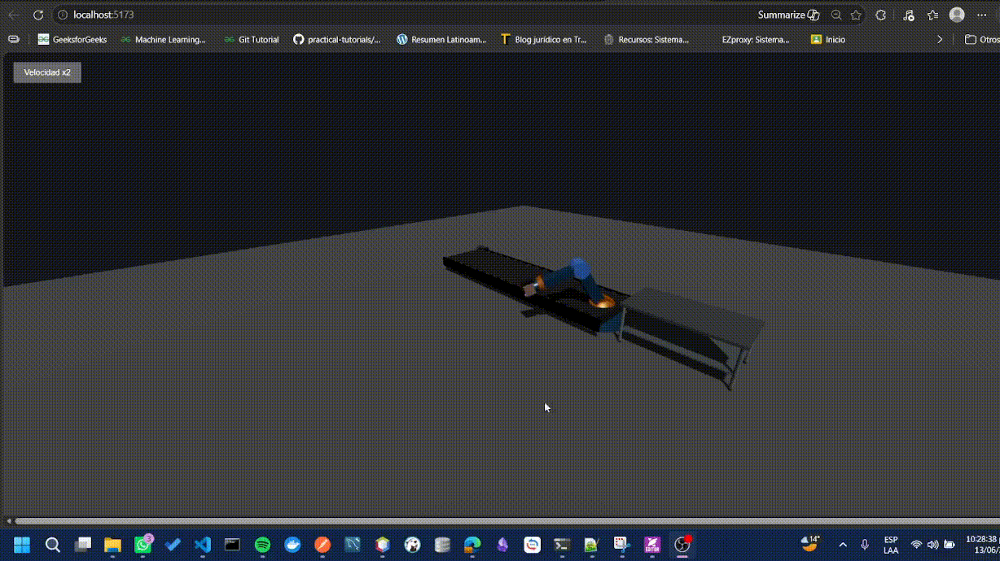
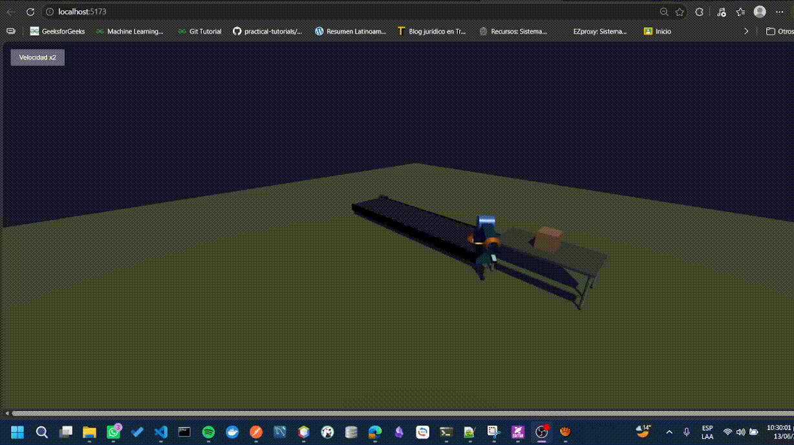

# Segundo ejercicio - parcial final - computación visual 👀 
## Datos del estudiante 🧑‍🎓
- Camilo Andrés Medina Sánchez
- Universidad Nacional de Colombia
- Facultad de ingeniería 
- Departamento de sistemas e industrial
- 2026 - 1S

## Enunciado 📜

Desarrollar una escena 3D interactiva utilizando Unity, Three.js o React Three Fiber que integre conceptos fundamentales de computación visual tales como:

- Jerarquías de objetos.
- Transformaciones geométricas.
- Materiales.
- Iluminación.
- Animaciones.
- Interacción con el usuario.

La temática seleccionada para el desarrollo fue **Robótica y Automatización Industrial**.

## Descripción de la solución 💫

Con el objetivo de representar un escenario industrial moderno, se desarrolló una simulación tridimensional de una línea de producción automatizada.

La escena representa una planta industrial simplificada en la cual una caja es transportada mediante una banda transportadora hasta una estación de manipulación. Posteriormente, un brazo robótico articulado recoge el objeto, lo desplaza hacia una zona de almacenamiento y finalmente regresa a su posición inicial para reiniciar el ciclo.

La solución fue desarrollada utilizando React Three Fiber, permitiendo aprovechar las capacidades de Three.js mediante componentes React reutilizables.

### Estructura de archivos 📁
A continuación, se muestra el árbol de archivos de manera resumida, de manera que solo se incluyan los archivos más importantes.

ejercicio_2_escena_3d_interactiva/
├── media/
├── src/
│   ├── node_modules/
│   ├── public/
│   └── src/
│       ├── assets/
│       ├── components/
│       │   ├── Conveyor.jsx
│       │   ├── Factory.jsx
│       │   └── RobotArm.jsx
│       ├── App.css
│       ├── App.jsx
│       ├── index.css
│       └── main.jsx
├── .gitignore
└── README.md

### Tecnologías utilizadas ⚙️

Para el desarrollo de la escena tridimensional se utilizó React como framework principal.

- React: Permite la construcción modular de interfaces mediante componentes reutilizables.
- Vite: Se utilizó como entorno de desarrollo y empaquetador debido a su rapidez de compilación.
- Three.js: Motor gráfico encargado del renderizado tridimensional mediante WebGL.
- React Three Fiber: Biblioteca que permite utilizar Three.js mediante componentes React.
- Drei: Conjunto de utilidades para React Three Fiber que simplifican la creación de controles, cámaras y otros elementos comunes.

### Ejecución 

#### Requisitos previos

Antes de ejecutar el proyecto se requiere:

- Node.js instalado.
- npm instalado.

#### Instalación

- Ubicarse en la carpeta raíz del proyecto.
- Instalar dependencias.
- Ejecutar el entorno de desarrollo.

```poweshell
> cd ejercicio_2_escena_3d
> npm install
> npm run dev
```
Por defecto la aplicación estará disponible en:

`http://localhost:5173`

### Manual de usuario

#### Interacción general

Una vez ejecutada la aplicación se visualizará la escena industrial completa.
La escena puede ser inspeccionada libremente mediante OrbitControls, para la rotación presionar el clic izquierda y mover el mouse, para el zoom hacer uso de la rueda del mouse, para el desplazamiento de la camara hacer uso del clic derecho y arrastrar.




#### Interacción personalizada

Por otro lado, se le permite al usuario tener una interacción directa con la animación de forma que pueda cambiar la velocidad de esta 





#### Flujo de la simulación 
La simulación funciona automáticamente siguiendo las siguientes etapas:

1. La caja aparece en la banda transportadora.
2. La banda desplaza la caja hacia el brazo robótico.
3. El brazo recoge la caja.
4. El brazo rota hacia la plataforma de almacenamiento.
5. La caja es depositada.
6. El brazo regresa a su posición inicial.
7. El ciclo vuelve a comenzar.

### Jerarquía de objetos

Uno de los conceptos más importantes implementados fue la jerarquía de transformaciones.

El brazo robótico se construyó mediante una estructura anidada.
```
Base
│
└── Hombro
     │
     └── Antebrazo
          │
          └── Muñeca
               │
               └── Garra
```
Gracias a esta estructura, las transformaciones realizadas sobre una articulación afectan automáticamente a los elementos descendientes.


### Iluminación
La iluminación es fundamental para la percepción de profundidad.
Se utilizaron dos tipos de luz:

**Ambient Light**
Proporciona iluminación general a toda la escena.

**Directional Light**
Simula una fuente de luz direccional capaz de generar sombras.

### Resultados obtenidos 📊
La solución desarrollada cumple satisfactoriamente con los requisitos planteados.

Se obtuvo una escena tridimensional funcional que integra:

- Modelado de objetos.
- Jerarquías.
- Transformaciones.
- Materiales.
- Iluminación.
- Animaciones.
- Interacción del usuario.
- Navegación mediante cámara libre.

La simulación reproduce correctamente el comportamiento esperado de una línea de producción automatizada.